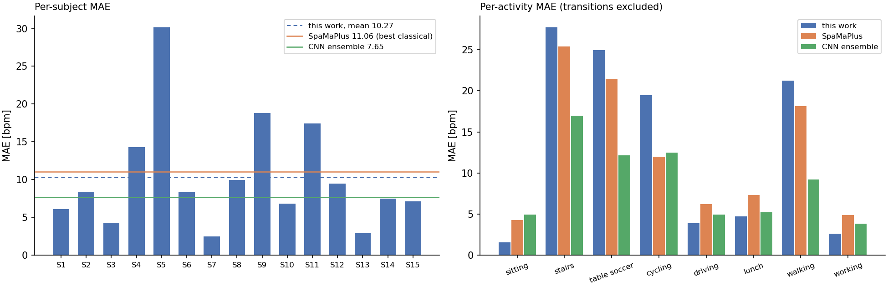
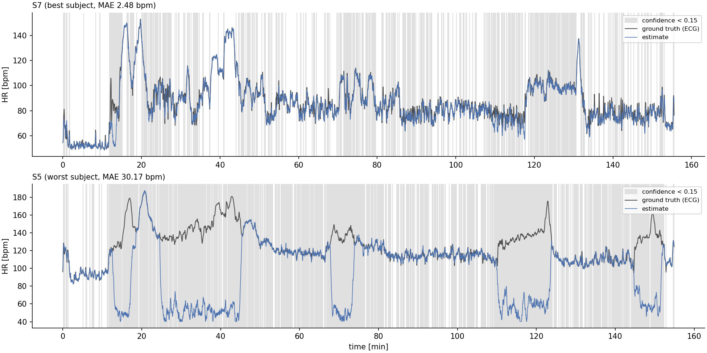
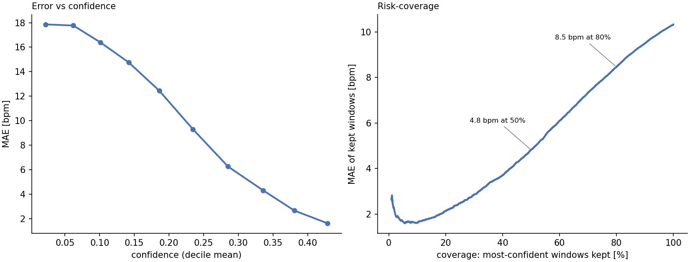

# biosignal-event-detection

Heart-rate estimation from wrist PPG under motion artifacts, built by transferring
a seismological signal-processing workflow to wearable biosignals.

I work on event detection in distributed acoustic sensing (DAS), where the daily
problem is recovering weak signals from continuous, multichannel, noise-dominated
sensor streams. Wrist PPG during daily activities is the same mathematical
problem: the pulse is buried under motion artifacts that share its frequency
band, a co-located accelerometer records the noise source directly, and the
quantity of interest is a smooth ridge in the time-frequency plane. This
repository ports that workflow, reference-channel noise suppression plus
continuity-constrained ridge tracking, to the public
[PPG-DaLiA](https://archive.ics.uci.edu/dataset/495/ppg+dalia) benchmark.
The two fields converged on the same tools independently: the tracking step here
is the same dynamic programming used for dispersion-curve ridge picking in
seismology, and it is also the Viterbi stage of the WFPV method of
[Temko (2017)](https://doi.org/10.1109/TBME.2017.2676243), which this pipeline
follows in spirit.

This is a methodology-transfer demonstration, not a claim of novelty and not a
claim of health-domain expertise.

## Method

Classical DSP only: no training, no learned parameters, ~4 s per subject on CPU.

1. **Windowed power spectra.** Band-pass 0.4-4.0 Hz, then 8 s windows shifted by
   2 s (the benchmark protocol), Hann taper, zero-padded FFT giving a 0.94 bpm
   frequency grid (this stands in for the phase vocoder of WFPV). Accelerometer
   spectra are computed per axis and averaged, on a grid that aligns with the
   PPG grid bin for bin.
2. **Wiener-style motion suppression.** Both spectra are normalized to unit
   power in the 40-210 bpm search band; the accelerometer spectrum acts as the
   noise estimate N(f) in a gain S/(S + alpha N) applied to the PPG spectrum.
   Frequencies where the wrist is moving are down-weighted.
3. **Viterbi tracking.** The cleaned spectra form the data term of a dynamic
   program whose transition prior is a Gaussian on the HR change per 2 s step,
   a physiological continuity constraint. The decoded path is refined to
   sub-bin precision by parabolic interpolation. Decoding is offline (the whole
   recording at once), unlike causal on-device trackers.
4. **Confidence.** Each window reports the fraction of in-band spectral power
   within 2 bpm of the decoded path: near 1 when a single clean ridge exists,
   near 0 when competing ridges remain.

The free parameters (noise weight alpha = 4, transition scale sigma = 2.5 bpm,
search band 40-210 bpm) were fixed using subjects S1-S3 only, before evaluating
all 15 subjects.

## Results

Protocol of Reiss et al. (2019): 8 s / 2 s windows, MAE in bpm against
ECG-derived ground truth, all 15 subjects (64,697 windows).

| Method | Type | MAE (bpm) |
|---|---|---|
| Schaeck2017 | classical | 20.45 |
| SpaMa | classical | 15.56 |
| SpaMaPlus | classical, best published | 11.06 |
| **this work (Wiener + Viterbi)** | **classical** | **10.27 +/- 7.03** |
| CNN average (Reiss 2019) | deep learning | 8.82 |
| CNN ensemble (Reiss 2019) | deep learning | 7.65 |
| Q-PPG (2021) | deep learning, quantized on-device | 4.41 |
| KID-PPG (2024) | deep learning, knowledge-informed | 2.85 |

Published numbers from Reiss et al. (2019) and the cited papers; only this work
was run here. The pipeline beats the best published classical method and loses
to trained models, as expected for an untrained method.



The error is bimodal rather than uniform: the pooled median error is 2.0 bpm
(50% of windows are within 2 bpm, 69% within 5 bpm), and the MAE is driven by
sustained tracking losses during intense activity. During stairs, table soccer,
and walking, the arm cadence overlaps the true HR band; the suppression step
then attenuates the pulse ridge together with the noise, and the tracker locks
onto low-frequency residual artifacts for minutes at a time (subject S5 below).



### The method knows when it is wrong

The confidence output flags exactly those failures: shaded regions above mark
low confidence, and they coincide with the excursions. Ranking windows by
confidence gives a clean risk-coverage tradeoff, keeping the most confident 50%
of windows yields 4.8 bpm MAE, 80% yields 8.5 bpm.



## What transferred, and what I learned

- **What transferred directly:** band-pass then window then power spectrum;
  reference-channel noise suppression (the accelerometer plays the role a
  common-mode or reference sensor plays in DAS); ridge tracking as dynamic
  programming with a physical continuity prior; reporting uncertainty next to
  every estimate.
- **What did not transfer:** a naive harmonic-sum data term, p(f) + w p(2f),
  which is a reasonable idea for boosting a suppressed fundamental. On the
  tuning subjects it doubled the error: rewarding f whenever 2f is strong also
  rewards the subharmonic of every strong motion ridge, injecting exactly the
  half-rate locking it was meant to prevent. Harmonic structure helps as a
  verification step (as in TROIKA), not as an additive bonus.
- **The failure mode is informative:** wrist acceleration does not see every
  artifact source (sensor-skin decoupling has a low-frequency optical signature
  with little inertial counterpart), so reference-channel suppression alone
  cannot close the gap to trained models. That gap is precisely what
  knowledge-informed learning (KID-PPG) closes, by keeping this DSP front end
  and learning what it cannot express.

## Reproduce

```bash
pip install -r requirements.txt
# download PPG-DaLiA (CC BY 4.0, ~2.9 GB) from
#   https://archive.ics.uci.edu/dataset/495/ppg+dalia
# and extract so that <data_dir>/S1/S1.pkl exists.
python scripts/run_eda.py <data_dir>            # spectrogram overview figure
python scripts/run_eda_waveforms.py <data_dir>  # per-activity waveform figure
python scripts/run_eval.py <data_dir>           # 15-subject evaluation + npz dump
python scripts/run_figures.py                   # result figures from the dump
```

## References

- Reiss, Indlekofer, Schmidt, Van Laerhoven (2019). Deep PPG: Large-Scale Heart
  Rate Estimation with Convolutional Neural Networks. Sensors 19(14). Dataset
  paper; source of the protocol and the classical/CNN baseline numbers.
- Temko (2017). Accurate Wearable Heart Rate Monitoring During Physical
  Exercises Using PPG. IEEE TBME 64(9). The WFPV method this pipeline follows.
- Zhang, Pi, Liu (2015). TROIKA. IEEE TBME 62(2).
- Burrello et al. (2021). Q-PPG: Energy-Efficient PPG-Based Heart Rate
  Monitoring on Wearable Devices. IEEE TBioCAS.
- Kechris, Dan, Miranda, Atienza (2024). KID-PPG: Knowledge-Informed Deep
  Learning for Extracting Heart Rate from a Smartwatch. IEEE TBME.

## License

MIT
